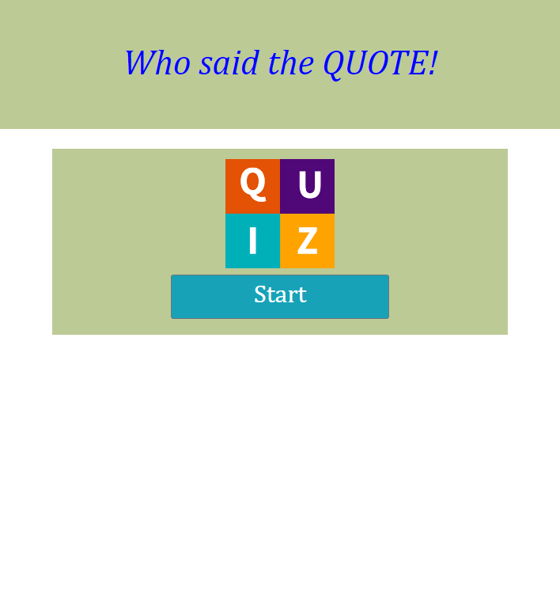
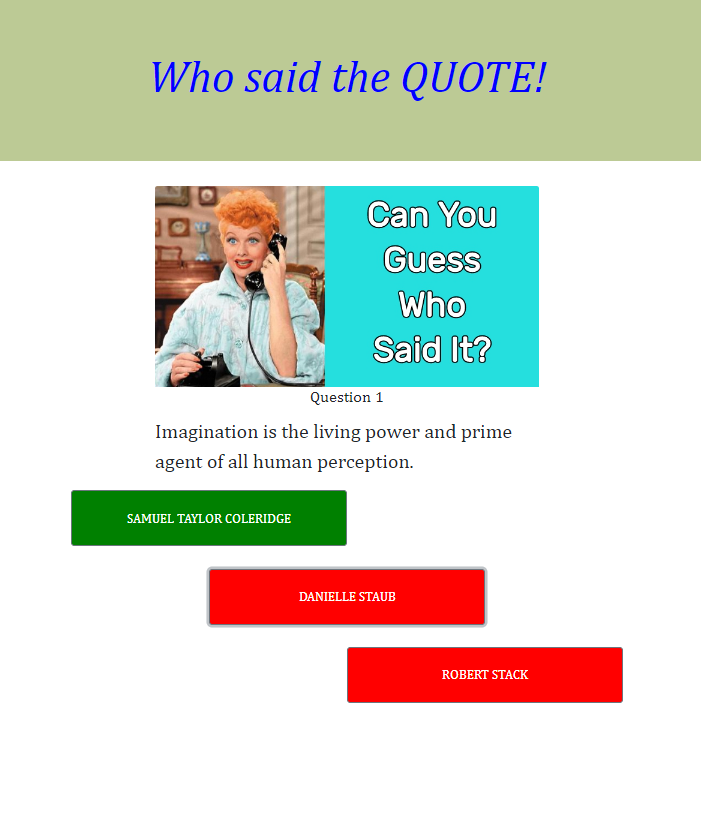
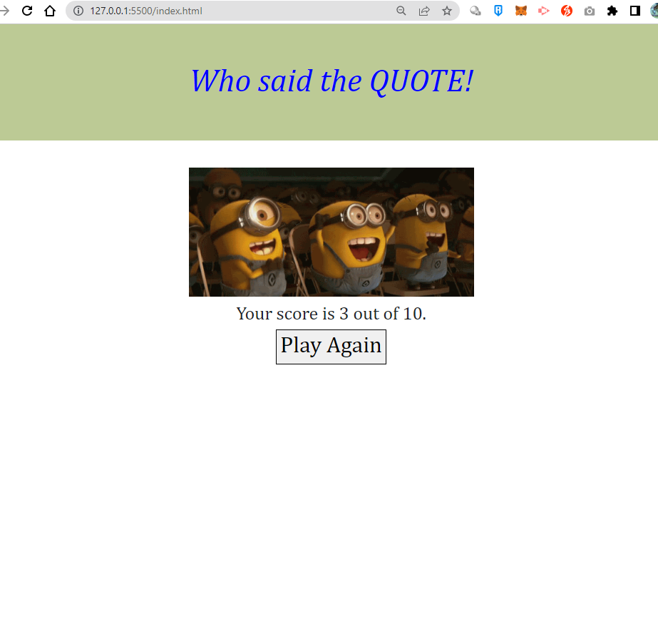

# Project1 - Who said the Qoute Quiz

## Description

Quoting is an important technique used to include information from outside sources. When using quotations, it is important that you also cite the original reference that you have taken the quotation from.

This Quote App will let the user test their skills and knowledge by choosing the correct author of the quote.

## Table of Content

1. Visual
2. Demo
3. Built with:
4. How to use the app
5. Links
6. Resources
7. License

## 1. Visual

### Image of the project in the webpage.

### short video clip to display the webpage responsiveness of the App.

## 2. Demo how to play the App

## 3. How to use the app

1. Read the instruction on how to play the quiz game.
2. Click the START button to display the quotes and the choices.
3. The timer starts when the user clicked the start button.
4. The chosen button will turn green when user clicked the correct answer.
5. The user can view the score after the quiz.

## 4. Built with:

- **Bootstrap** is the most popular HTML, CSS, and JavaScript framework for developing responsive, mobile-first websites.
- **API** are mechanisms that enable two software components to communicate with each other using a set of definitions and protocols.
- **JavaScript** is a scripting or programming language that allows you to implement complex features on web pages.
- **CSS** is a computer language for laying out and structuring web pages
- **HTML** is the standard markup language for creating Web pages, describes the structure of a Web page and consists of a series of elements.
- **Local Storage** is a property that allows JavaScript sites and apps to save key-value pairs in a web browser with no expiration date, the data stored in the browser will persist even after the browser window is closed

## 5. Links

### Source code location

- https://github.com/Ailsadm/Who-said-the-quote-Quiz

### Deployed website URL

- https://ailsadm.github.io/Who-said-the-quote-Quiz/

## 6. Resources

### URL for resources

- https://getbootstrap.com/docs/5.3/components/buttons/

- https://api-ninjas.com/

- https://github.com/lukePeavey/quotable#get-random-quote

- https://javascript.info/async-await

- https://developer.mozilla.org/en-US/docs/Learn/JavaScript/Client-side_web_APIs/Client-side_storage

### API Reference

#### https://api.quotable.io/random

#### https://api-ninjas.com/api/celebrity

## 7. License

This project is licensed by MIT.
